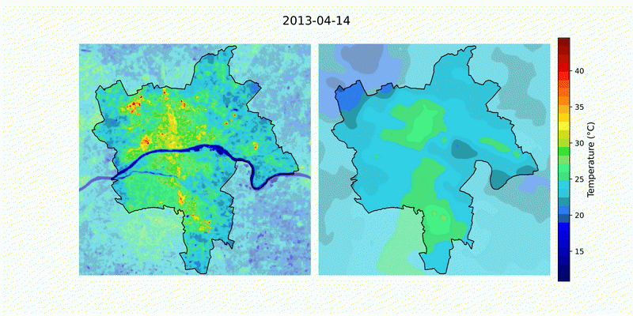
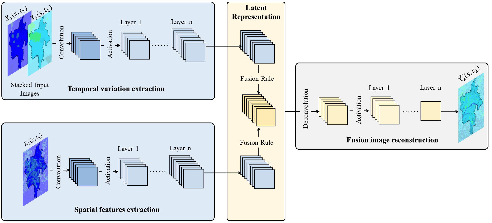
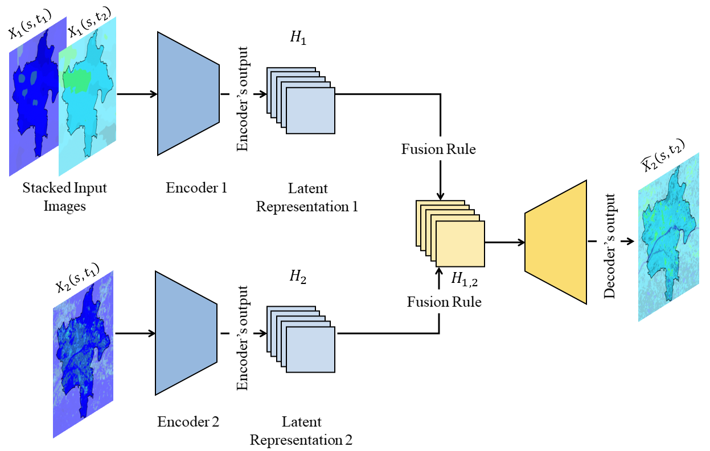
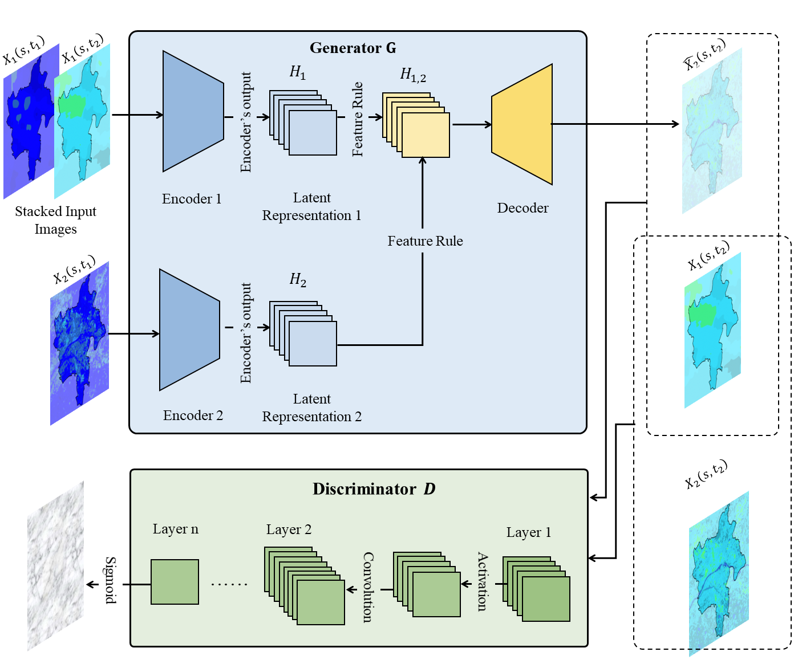

# Deep Learning for Spatio-Temporal Fusion in Land Surface Temperature Estimation: A Comprehensive Survey, Experimental Analysis, and Future Trends

This repository provides the necessary scripts to reproduce the MODIS–Landsat Land Surface Temperature (LST) dataset (STF-LST). In addition, it includes a collection of deep learning–based spatio-temporal fusion (STF) models for remote sensing, with particular emphasis on methods that have been applied to or evaluated on LST data.



[**Dataset description**](#Dataset-description)
| [**Guide of use**](#Guide-of-use)
| [**Deep Learning-based STF Models**](#Deep-Learning-based-STF-Models)
| [**ArXiv**](https://arxiv.org/pdf/2412.16631)
| [**How to cite us ?**](#How-to-cite)

## Dataset description 

The STF-LST dataset is designed for the evaluation of STF methods applied to LST. It is built from paired MODIS/Terra and Landsat 8 thermal observations over the Orléans Métropole (Centre-Val de Loire, France), covering a long temporal span and diverse thermal conditions.

The dataset consists of 51 MODIS–Landsat LST pairs acquired between April 2013 and October 2024. MODIS provides daily LST observations at coarse spatial resolution (1 km), while Landsat 8 offers finer spatial detail (30 m) with a 16-day revisit cycle. Both sensors have similar mid-morning overpass times, ensuring strong temporal consistency between paired acquisitions.

All images were accessed via Google Earth Engine and include standard atmospheric corrections, emissivity adjustments, and quality masks. Only scenes with acceptable cloud coverage were retained (< 10 % for MODIS, < 20 % for Landsat 8). After gap correction, all images were harmonized to a common spatial resolution of 30 m.

The repository provides:
* Scripts to reproduce the dataset directly from GEE.
* Preprocessing pipelines for gap filling, resampling, and patch extraction.
* A standardized dataset organization with MODIS–Landsat pairs structured into temporal triplets.


## Guide of use
To generate the STF-LST dataset, run the following command in your terminal:  

```bash
python3 run.py
```
The code utilizes the Google Earth Engine platform, so you will need a valid account for authentication before downloading the data.

Please note that this process may take some time.

## Requirements
This repository uses the following versions:
- Python (v3.9.19).
- Torch (v2.4.1+cu121).
- Scipy (v1.13.1).
- Earth Engine (v1.1.2).
- Geemap (v0.34.5).
- Rasterio (v1.3.10).
- NumPy (v1.26.4).
- Pandas (V2.2.2).

## Deep Learning-based STF Models
### Convolutional Neural Networks
CNN-based STF methods leverage CNNs to automatically model the complex, non-linear relationships between LSHT and HSLT satellite image pairs, which are then used to predict high-resolution target satellite images. Although CNNs are primarily designed for spatial modeling, temporal information can be incorporated by processing multiple temporal images through separate CNN streams and fusing their outputs to capture spatio-temporal variations.

The following figure illustrates a typical CNN-based STF architecture using a single pair $P_1$. The network consists of four main blocks:

1. *Spatial feature extraction*, where the high-resolution satellite image is processed through convolutional layers to obtain compressed spatial features,
2. *Temporal variation extraction*, where two low-resolution satellite images are concatenated along channels and passed through convolutional layers to capture temporal features,
3. *Feature fusion*, where spatial and temporal representations are combined in a latent space, and
4. *Reconstruction*, where deconvolutional layers and fully connected layers generate the predicted high-resolution satellite image.

When multiple pairs are used, each pair is processed similarly, and their weighted outputs are integrated to produce the final prediction.

<div align="center" style="margin-top: 30px;">
  
</div>

- [**Spatiotemporal Satellite Image Fusion Using Deep Convolutional Neural Networks**](https://ieeexplore.ieee.org/document/8291042/)
    
  **Note:** This method has not been applied to LST.

- [**Deriving high spatiotemporal remote sensing images using deep convolutional network**](https://www.mdpi.com/2072-4292/10/7/1066)
  [[Code]](https://github.com/theonegis/dcstfn)  
  **Note:** This method has not been applied to LST.

- [**StfNet:A two-stream convolutional neural network for spatiotemporal image fusion**](https://ieeexplore.ieee.org/document/8693668)
    
  **Note:** This method has not been applied to LST.

- [**Spatiotemporal fusion of satellite images via very deep convolutional networks**](https://www.mdpi.com/2072-4292/11/22/2701)
    
  **Note:** This method has not been applied to LST.

- [**Spatiotemporal fusion of land surface temperature based on a convolutional neural network**](https://ieeexplore.ieee.org/document/9115890/)
    
  **Note:** This method has been applied to LST (✓).

- [**Spatiotemporal fusion of remote sensing image based on deep learning**](https://onlinelibrary.wiley.com/doi/10.1155/2020/8873079)
    
  **Note:** This method has not been applied to LST.

- [**A new sensor bias-driven spatio-temporal fusion model based on convolutional neural networks**](https://link.springer.com/article/10.1007/s11432-019-2805-y)
    
  **Note:** This method has not been applied to LST.

- [**MUSTFN: A spatiotemporal fusion method for multi-scale and multi-sensor remote sensing images based on a convolutional neural network**](https://www.sciencedirect.com/science/article/pii/S1569843222003016)
  [[Code]](https://github.com/qpyeah/MUSTFN)  
  **Note:** This method has not been applied to LST.

- [**Spatio–temporal–spectral collaborative learning for spatio–temporal fusion with land cover changes**](https://ieeexplore.ieee.org/document/9803281/)
      
  **Note:** This method has not been applied to LST.

- [**Supervised and self-supervised learning-based cascade spatiotemporal fusion framework and its application**](https://www.sciencedirect.com/science/article/abs/pii/S0924271623002034)
      
  **Note:** This method has been applied to LST (✓).

- [**An Unsupervised Model Based on Convolutional Neural Network for Fusing Landsat-8 and Sentinel-2 Data**](https://ieeexplore.ieee.org/document/10642772)
    
  **Note:** This method has not been applied to LST.


### Autoencoder

AE-based STF methods extend traditional AEs to model both spatial and temporal relationships between low spatial resolution (high temporal resolution) and high spatial resolution (low temporal resolution) image pairs. Although AEs are primarily unsupervised, STF applications adapt them for supervised tasks using an *encoder–fusion–decoder* design, as illustrated in the following figure.

In this architecture, a spatial encoder processes the high-resolution satellite image to produce a latent representation H₁, while a temporal encoder compresses two low-resolution satellite images into H₂. The latent representations H₁ and H₂ are then fused through a tailored mechanism to capture spatio-temporal dependencies.

The merged latent representation is decoded to reconstruct the predicted high-resolution satellite image X̂₂.

<div align="center" style="margin-top: 30px;">
  
</div>

- [**An enhanced deep convolutional model for spatiotemporal image fusion**](https://www.mdpi.com/2072-4292/11/24/2898)
  [[Code]](https://github.com/qpyeah/MUSTFN)  
  **Note:** This method has not been applied to LST.
  
- [**Spatiotemporal fusion network for land surface temperature based on a conditional variational autoencoder**](https://ieeexplore.ieee.org/document/9795341)
      
  **Note:** This method has been applied to LST (✓).


### Generative Adversarial Networks
GAN-based STF models consist of two primary components, as illustrated in the following figure: the *generator* and the *discriminator*.  The generator is responsible for producing high-resolution fused satellite images using either a single or two temporal satellite pairs (P₁ and P₃). The discriminator evaluates these outputs by distinguishing real high-resolution satellite images from generated ones. Conditional GANs (cGANs) are the most widely adopted variant for STF, as conditioning the generation process on low-resolution inputs helps maintain spatial and temporal consistency.  

The generator typically follows a three-stage design: *feature extraction*, *feature fusion*, and *image reconstruction*. An encoder–decoder architecture is commonly used to enhance spatial resolution during the extraction and reconstruction stages, while the fusion module integrates multi-spatial and multi-temporal features to produce temporally coherent predictions. The discriminator receives as input both the coarse-resolution satellite image at the target date and either the real or the generated fine-resolution satellite image. Its objective is to output a probability indicating whether the pair is real (ground truth) or fused (generated), usually achieved with a sigmoid activation in the final layer. During training, when the discriminator is provided with real pairs (true fine-resolution and coarse-resolution LST images), it is encouraged to classify them as real (label 1). Conversely, when presented with fused pairs (generated fine-resolution and coarse-resolution LST images), it learns to classify them as fake (label 0).

<div align="center" style="margin-top: 30px;">
  
</div>

- [**Spatiotemporal fusion via CycleGAN-based image generation**](https://ieeexplore.ieee.org/document/9206067)
    
  **Note:** This method has not been applied to LST.

- [**Remote sensing image spatiotemporal fusion using a generative adversarial network**](https://ieeexplore.ieee.org/document/9159647)
    
  **Note:** This method has not been applied to LST.

- [**Explicit and stepwise models for spatiotemporal fusion of remote sensing images with deep neural networks**](https://www.sciencedirect.com/science/article/pii/S0303243421003184)
    
  **Note:** This method has not been applied to LST.

- [**A flexible reference-insensitive spatiotemporal fusion model for remote sensing images using conditional generative adversarial network**](https://ieeexplore.ieee.org/document/9336033)
  [[Code]](https://github.com/theonegis/ganstfm)  
  **Note:** This method has not been applied to LST.

- [**An object-based spatiotemporal fusion model for remote sensing images**](https://www.tandfonline.com/doi/full/10.1080/22797254.2021.1879683)
    
  **Note:** This method has not been applied to LST.

- [**A multilevel feature fusion with GAN for spatiotemporal remote sensing images**](https://ieeexplore.ieee.org/document/9781347)
  [[Code]](https://github.com/songbingze/MLFF-GAN)  
  **Note:** This method has not been applied to LST.

- [**A robust model for MODIS and Landsat image fusion considering input noise**](https://ieeexplore.ieee.org/document/9687540)
  [[Code]](https://github.com/theonegis/rsfn)  
  **Note:** This method has not been applied to LST.

- [**An Adaptive Multiscale Generative Adversarial Network for the Spatiotemporal Fusion of Landsat and MODIS Data**](https://www.mdpi.com/2072-4292/15/21/5128)
  [[Code]](https://github.com/xxsfish/AMS-STF)  
  **Note:** This method has not been applied to LST.

- [**Remote sensing image spatiotemporal fusion with diffusion models**](https://www.sciencedirect.com/science/article/abs/pii/S1566253524002835)
  [[Code]](https://github.com/prowDIY/STF)  
  **Note:** This method has not been applied to LST.

- [**Conditional Generative Model Fusion Network for Land Surface Temperature Generation**](https://ieeexplore.ieee.org/document/11034654)
      
  **Note:** This method has been applied to LST (✓).

### Vision Transformers
ViT-based STF models leverage self-attention mechanisms to capture long-range spatial and temporal dependencies more effectively than convolutional architectures.  

As shown in the following figure, each input satellite image is first decomposed into a sequence of fixed-size patches, to which positional embeddings are added in order to preserve spatial structure. A spatial transformer encoder processes the high-resolution observation, while a temporal transformer encoder compresses the two coarse-resolution satellite images into latent patch representations. The resulting spatial and temporal sequences are then fused and fed into a transformer decoder, which reconstructs the output patch sequence. After reshaping, the model produces the final high-resolution prediction at the target date.

<div align="center" style="margin-top: 30px;">
  
</div>

- [**A multi-stream fusion network for remote sensing spatiotemporal fusion based on transformer and convolution**](https://www.mdpi.com/2072-4292/13/18/3724)
    
  **Note:** This method has not been applied to LST.

- [**MSFusion: Multistage for remote sensing image spatiotemporal fusion based on texture transformer and convolutional neural network**](https://ieeexplore.ieee.org/document/9786792/)
    
  **Note:** This method has not been applied to LST.

- [**Remote sensing spatiotemporal fusion using Swin transformer**](https://ieeexplore.ieee.org/document/9795183)
  [[Code]](https://github.com/LouisChen0104/swinstfm)  
  **Note:** This method has not been applied to LST.

- [**Enhanced multi-stream remote sensing spatiotemporal fusion network based on transformer and dilated convolution**](https://www.mdpi.com/2072-4292/14/18/4544)
     
  **Note:** This method has not been applied to LST.

- [**CNN-Transformer combined Remote Sensing Imagery Spatiotemporal Fusion Model**](https://ieeexplore.ieee.org/document/10614805)
     
  **Note:** This method has not been applied to LST.

- [**STF-Trans: A two-stream spatiotemporal fusion transformer for very high resolution satellites images**](https://www.sciencedirect.com/science/article/abs/pii/S0925231223009918)
     
  **Note:** This method has not been applied to LST.
  
- [**SFT-GAN: Sparse Fast Transformer Fusion Method Based on GAN for Remote Sensing Spatiotemporal Fusion**](https://www.mdpi.com/2072-4292/17/13/2315)
  [[Code]](https://github.com/MaZhaoX/SFT-GAN)  
  **Note:** This method has not been applied to LST.
  
- [**A Two-Stage Hierarchical Spatiotemporal Fusion Network for Land Surface Temperature With Transformer**](https://ieeexplore.ieee.org/document/10930886)
  [[Code]](https://github.com/HuPengHua2021/THSTNet)  
  **Note:** This method has been applied to LST (✓).

### Recurrent Neural Networks
In RNN-based STF, the aim is to leverage temporal dependencies between coarse and fine-resolution satellite images.  

Given a sequence of n temporal satellite pairs, Pᵢ, the RNN is trained to map coarse-resolution inputs to fine-resolution predictions at each time step tᵢ, denoted as X̂₂(s,tᵢ), for i ∈ [1,n]. After training, the model generates fine-resolution estimates for new time steps, which are then fused with existing coarse-resolution data to reconstruct high-quality satellite image outputs.

- [**A robust hybrid deep learning model for spatiotemporal image fusion**](https://www.mdpi.com/2072-4292/13/24/5005)
     
  **Note:** This method has not been applied to LST.

- [**Spatio–temporal–spectral collaborative learning for spatio–temporal fusion with land cover changes**](https://ieeexplore.ieee.org/document/9803281)
     
  **Note:** This method has not been applied to LST.
  
- [**Time-Series-Based Spatiotemporal Fusion Network for Improving Crop Type Mapping**](https://www.mdpi.com/2072-4292/16/2/235)
     
  **Note:** This method has not been applied to LST.


## Authors 
This comprehensive review, alongside the STF-LST dataset, has been developed by Sofiane Bouaziz, Adel Hafiane, Raphaël Canals, and Rachid Nedjai.

## How to cite?
In case you are using STF-LST dataset for your research, please consider citing our work:

```BibTex
@article{bouaziz2024deep,
  title={Deep Learning for Spatio-Temporal Fusion in Land Surface Temperature Estimation: A Comprehensive Survey, Experimental Analysis, and Future Trends},
  author={Bouaziz, Sofiane and Hafiane, Adel and Canals, Raphael and Nedjai, Rachid},
  journal={arXiv preprint arXiv:2412.16631},
  year={2024}
}
```
